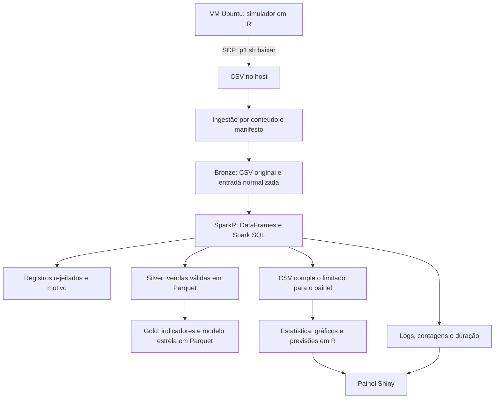

# Arquitetura do PI completo

Título geral: **Automação e escalabilidade de pipelines de Big Data e análise de dados**.
Subtítulo proposto: análise de vendas simuladas de artigos esportivos.

## Problema e decisão apoiada

Pergunta proposta: como as vendas variam por produto, canal, região e mês, e quais
informações ajudam no planejamento comercial? Confirmar o problema com o beneficiário.
Os indicadores são pedidos, itens, faturamento líquido, desconto e ticket médio.
Dados sintéticos demonstram o método, sem comprovar desempenho real da Track & Field.
O uso do nome no projeto não comprova parceria, autorização ou acesso à operação.

## Fluxo implementado

Escolha: **Data Lake em camadas**, com um **modelo dimensional analítico na camada
gold**. Não há servidor de Data Warehouse ou metastore Hive implantado. Parquet
organiza resultados tipados e separa armazenamento da apresentação. A camada
bronze mantém a origem para auditoria e reprocessamento. Cada processamento cria
um snapshot próprio; não se devem somar snapshots diferentes como novas vendas.

ETL: extrair CSVs da VM, validar esquema e identidade, transformar no Spark,
carregar vendas válidas, dimensões e indicadores em Parquet. A ingestão elimina
cópias byte a byte por MD5 (identificação de conteúdo, não mecanismo de segurança).
O Spark remove duplicatas de conteúdo normalizado e rejeita conflitos por chave.
R e Spark recalculam valores em centavos com empate para o par, normalizando
resíduos binários a seis casas de centavo antes de arredondar. Por exemplo,
15% de R$ 149,70 resulta em R$ 22,46 de desconto e R$ 127,24 líquidos.
Os CSVs originais permanecem preservados mesmo quando o total é corrigido.

## Modelo dimensional

Grão da fato: um pedido simulado por execução. Chave composta: `execucao + pedido`.
Cada pedido do simulador representa um produto. Dimensões e fato usam os mesmos
campos e funções para gerar suas chaves.

| Tabela | Chave | Conteúdo |
|---|---|---|
| fato_vendas | execução e pedido | quantidade, preço, desconto, valores bruto, desconto e líquido |
| dim_produto | hash de produto e categoria | produto e categoria |
| dim_canal | hash do canal | canal de venda |
| dim_regiao | hash da região | região |
| dim_data | AAAAMMDD | data, ano, mês e trimestre |

Não há identificação real de clientes. O identificador sintético de cliente se
repete entre lotes e não sustenta análises de recompra ou retenção.

## Hadoop e escala

Modo `local`: Spark lê e escreve no sistema de arquivos local. Modo `hdfs`: os
dados bronze, silver, gold e a quarentena ficam no HDFS. Há um NameNode e um
DataNode com replicação 1, em um único host, acessíveis apenas em loopback.
É uma demonstração pseudodistribuída: não fornece redundância, tolerância à perda
do host nem evidência de desempenho de um cluster com vários servidores.

Spark executa em `local[2]`, com dois threads. Usa DataFrames e SQL de verdade,
inclusive verificação da equivalência de um agrupamento nas duas APIs. Hadoop
armazena e Spark processa. YARN e Hive não são necessários nesta configuração.
O modo local do Spark é intencional para caber no computador de apresentação.

| Conceito | Relação com o caso proposto | Limite da demonstração |
|---|---|---|
| Volume | histórico de vendas de muitos canais e lojas | os lotes pequenos não são Big Data por si só |
| Velocidade | chegada recorrente de lotes | processamento batch, sem streaming |
| Variedade | categorias, canais, locais e datas | entrada atual é CSV estruturado |
| Veracidade | rejeições, duplicidades e validação dos totais | dados sintéticos e regras simplificadas |
| Valor | indicadores que apoiam planejamento | benefício real depende da validação com o beneficiário |

Para múltiplos servidores seriam necessários endereços de rede apropriados,
autenticação, permissões, replicação, backup, gerenciador de recursos e medição
de carga. A configuração em loopback não deve ser apresentada como produção.
O estágio de ingestão usa R e lê um arquivo por vez em memória. O Shiny recebe
no máximo 200 mil vendas completas. Acima disso, Spark mantém os Parquets e
indicadores, mas não exporta uma amostra silenciosa para o painel.

## Arquivos principais

| Arquivo | Função |
|---|---|
| R/lotes.R | ingestão, identidade por conteúdo e leitura da última execução |
| scripts/pipeline_bigdata.sh | sequência, bloqueio de concorrência e monitoramento |
| spark/processar.R | tratamento, SQL, DataFrames, Parquet e modelo dimensional |
| scripts/publicar_spark.R | conferência R/Spark e publicação para o painel |
| infraestrutura/bigdata/ | instalação e ciclo de vida do HDFS |
| R/estatistica.R | descritivas, frequências e probabilidades empíricas |
| R/painel.R | resultados, fonte dos dados e estado do pipeline |

Referências técnicas: [SparkR 3.5.8](https://spark.apache.org/docs/3.5.8/sparkr.html)
e [Hadoop 3.4.2 em um nó](https://hadoop.apache.org/docs/r3.4.2/hadoop-project-dist/hadoop-common/SingleCluster.html).
Requisitos acadêmicos: documento de orientação PI 2026-2, páginas 7–11 do PDF.
